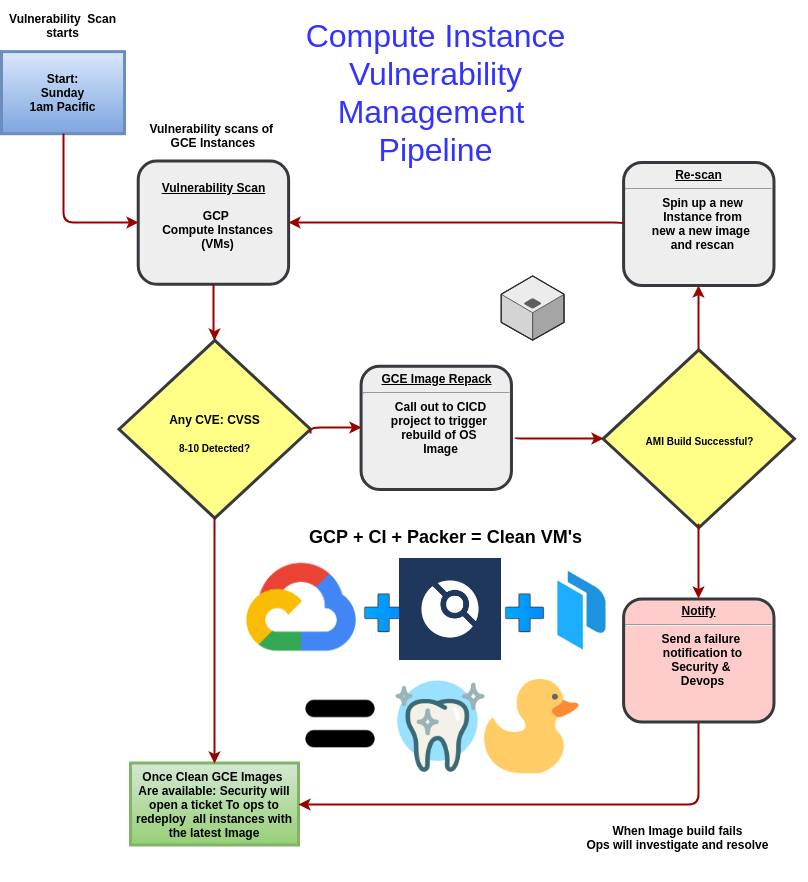

# Windows Server Hardening

## Pack a Microsoft© Windows Server©, apply customizations and security baseline hardening        

Vulnerability management CI flow:    

This is an automation of the work provided © Microsoft
[Security-baseline-FINAL-for-Windows-10-v1809-and-Windows-Server](https://techcommunity.microsoft.com/t5/Microsoft-Security-Baselines/Security-baseline-FINAL-for-Windows-10-v1809-and-Windows-Server/ba-p/701082)    

### How is this run? See the [.drone.yml](.drone.yml) job section

### GCP Environment Variables:

`ENV ADMIN_PWD_CIPHERTEXT`    
### Encrypt a string using a KMS Key shared with the service account running this build

`ENV ARTIFACT_BUCKET`     
#### Share a GCS storage bucket with the service account running this build

`ENV GCLOUD_SERVICE_KEY`     
#### Provide the JSON format Service account as a string as an environment variable for authentication     

`ENV GOOGLE_APPLICATION_CREDENTIALS`     
#### Provide the path the the aformentioned service account JSON file within the docker container for your build system.     
#### for Drone.io CI it's typically /drone/src/drone.json     

`ENV GOOGLE_COMPUTE_ZONE`     
#### The zone in which your compute resources lie in.     

`ENV GOOGLE_PROJECT_ID`     
#### The GCloud project ID     

`ENV GCP_NETWORK_ID`     
#### Use a custom (vs the default) network     

`ENV GCP_SUBNET_ID`     
#### Provide the custom subnet ID     

`ENV SECRETS_KEYRING`     
`ENV SECRETS_KEY`     
#### Share a Key with the service account running this build.     
#### We use a KMS key to share secrets between the image builder and secrets storage in the cloud.     

---

2019 #### gjyoung1974@gmail.com
